# 玩法说明（当前版本）

打开方式（体验版服务）：

- 打开浏览器访问：`http://localhost:4173/`
- 或：`http://127.0.0.1:4173/`
- 如果访问不了：在项目根目录运行 `npm run preview:daemon`（启动），运行 `npm run preview:stop`（停止）

示意图（HUD/世界）：

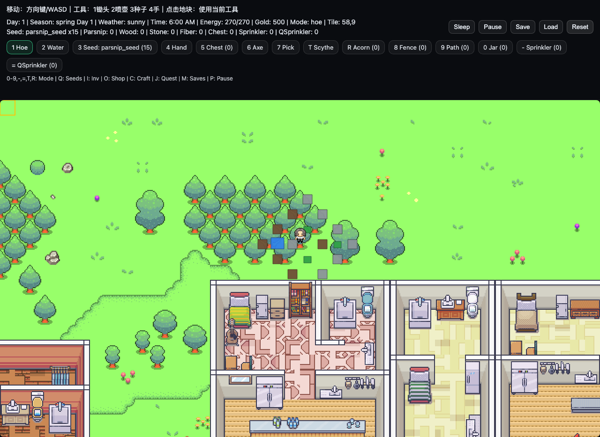

---

## 1. 核心目标：体验“农耕闭环”

你可以在地图上完成一套最小循环：

1) 锄地（把草地变成耕地）  
2) 浇水（当天有效）  
3) 播种（多种种子，按季节售卖）  
4) 睡觉/过天（作物成长推进）  
5) 成熟后用“手”收获，产物进入背包  
6) 购买并放置箱子（Chest），把物品存进去（可跨天保存）
7) 采集资源：用斧头/镐子砍木头/挖石头，获得 `wood` / `stone`
8) 出货：把物品放进 Shipping Bin，睡觉时自动卖出获得金币
9) 自动浇水：制作并放置洒水器（Sprinkler），睡觉后会在新的一天开始时自动浇水周围耕地
10) 清理杂草：用镰刀清理 `weed` 获得 `fiber`
11) 种树：购买并种下 `acorn`，睡觉后会逐天长大；成熟后可用斧头砍伐获得大量 `wood`
12) 再生作物：蓝莓/蔓越莓成熟后可重复收获（需要再次浇水并等待若干天）
13) 每日任务：打开 Quest 面板提交物品换取金币奖励
14) 多存档槽：支持 Slot 1/2/3 独立存档，并支持导入/导出 JSON
15) NPC 对话与好感：与 NPC 对话会提升好感（每天一次）
16) NPC 送礼：对 NPC 送礼会消耗 1 个物品并影响好感（每天一次；不同物品有不同喜好）
17) 吃东西恢复体力：在背包里把可食用物品拿到 Cursor，点 `Eat Cursor (1)` 恢复体力（不耗时）

---

## 2. 操作方式

### 2.1 移动

- 方向键 或 `W/A/S/D`

### 2.2 工具/模式切换（快捷键）

- `1`：锄头（Hoe）
- `2`：喷壶（Water）
- `3`：种子（使用“当前选中”的种子）
- `4`：手（Hand，用于收获/打开箱子）
- `5`：箱子（Chest，放置箱子）
- `6`：斧头（Axe，用于砍木头资源）
- `7`：镐子（Pickaxe，用于挖石头资源）
- `8`：栅栏（Fence，放置栅栏）
- `9`：地砖（Path，放置地砖）
- `0`：罐子（Preserves Jar，放置加工罐子）
- `-`：洒水器（Sprinkler，放置基础洒水器）
- `=`：高级洒水器（Quality Sprinkler，放置 8 格洒水器）
- `T`：镰刀（Scythe，清理杂草 weed 获得 fiber）
- `R`：橡果（Acorn，种树）
- `G`：送礼（Gift，对 NPC 送礼）
- `Q`：循环切换“当前选中”的种子（只会在你背包里有对应种子时才会切到）
- `C`：制作（Craft，打开制作面板）
- `J`：任务（Quest，打开每日任务面板）
- `M`：存档（Save Slots，切换存档槽/导入导出）
- `Esc`：关闭对话（Dialogue）

当前工具会在 HUD 的 `Mode` 与下方快捷栏高亮显示。

### 2.3 使用工具

- 鼠标左键点击地块：对该地块使用当前工具

示意图（耕地/浇水/成熟作物）：

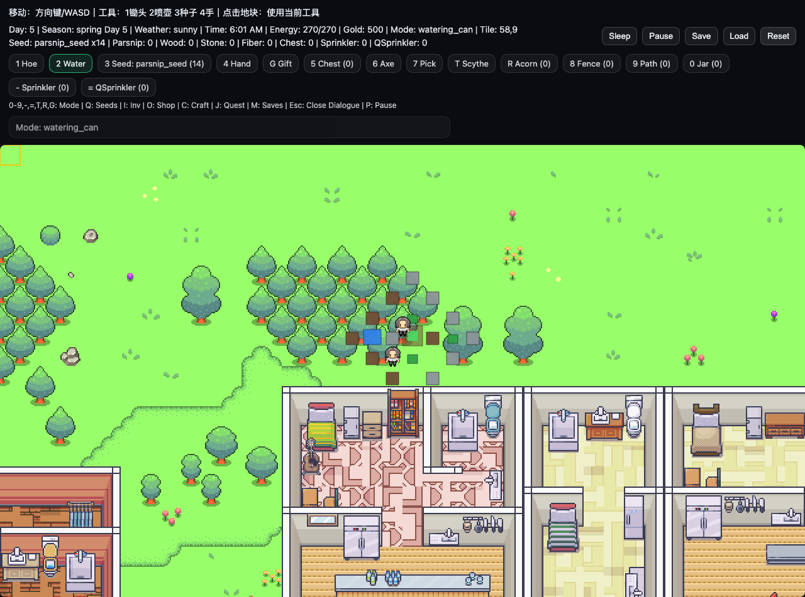

示意图（再生作物多次收获，背包里会累积产物）：

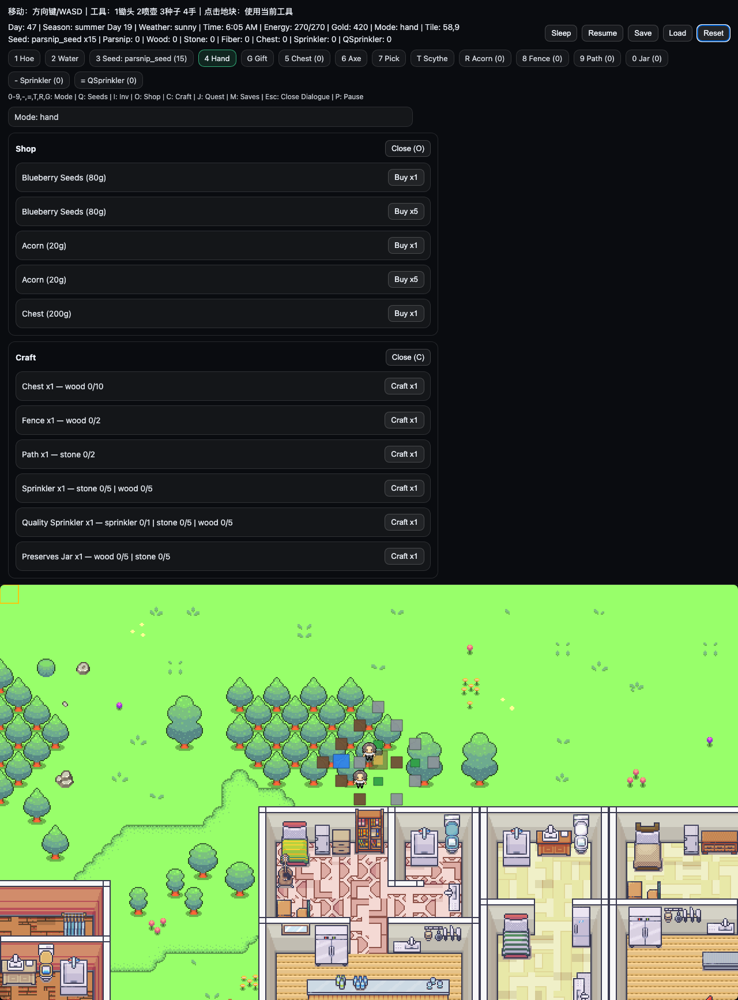

示意图（Quest 面板，提交物品领取奖励）：

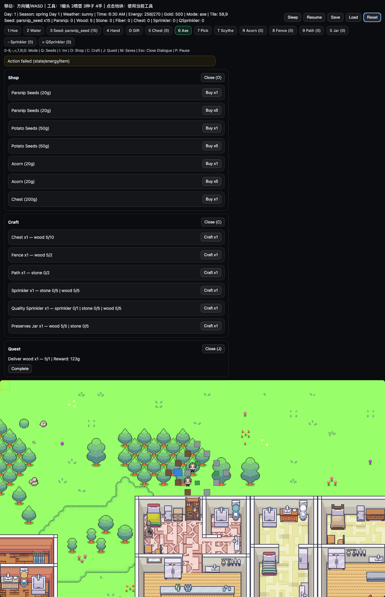

示意图（Save Slots：切换 Slot 1/2/3，导入/导出）：

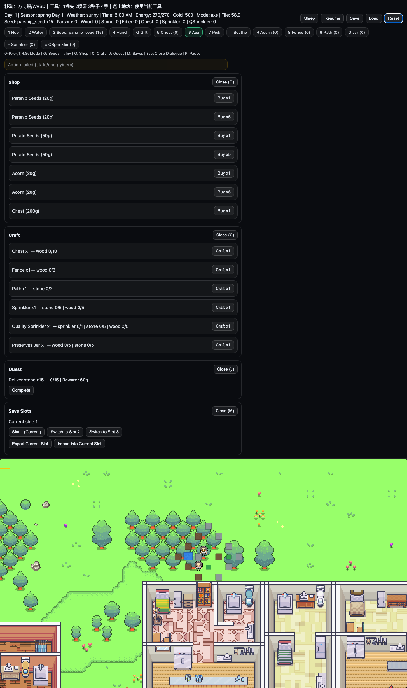

示意图（NPC 对话：对话后好感提升）：

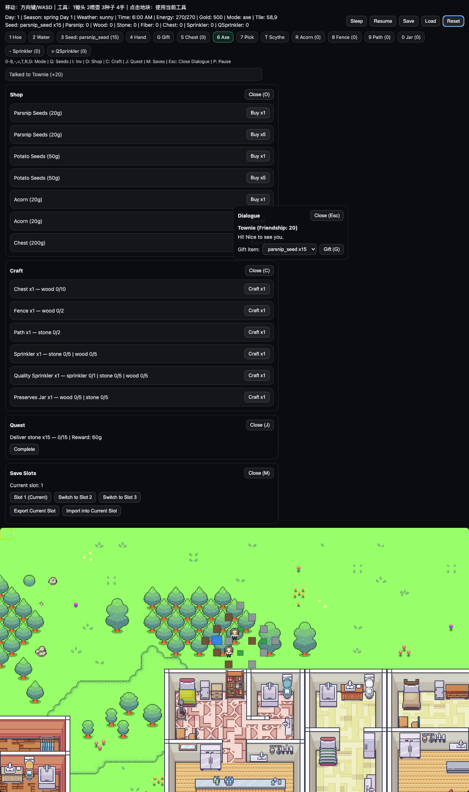

示意图（送礼：按 `G` 进入 Gift 模式，对着 NPC 点击送礼；或先用 Hand 对话打开面板，选择物品后点 Gift 按钮）：

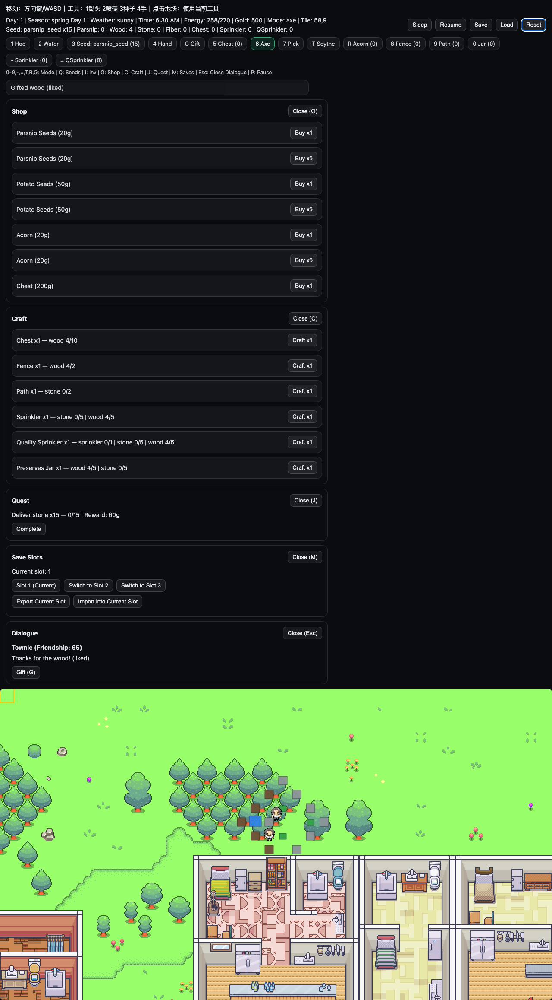

示意图（吃东西：背包 Cursor 拿起 `parsnip`，点 Eat Cursor 恢复体力）：

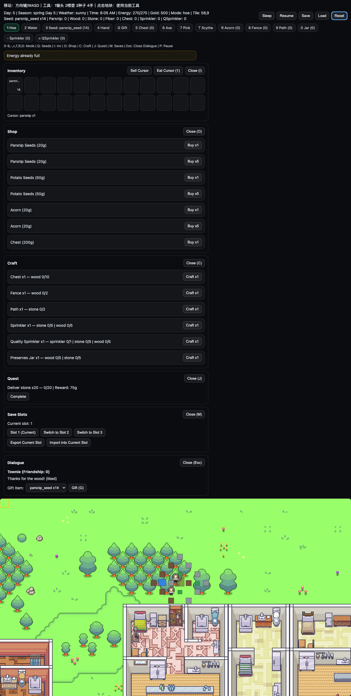

交互限制（更接近星露谷的手感）：

- 只能操作玩家**相邻 1 格（上下左右）**范围内的地块
- 选格框颜色提示：
  - 绿色：可操作范围内
  - 黄色：太远（需要走近）
  - 红色：不可用（碰撞/阻挡）

### 2.4 时间与暂停

- 时间会自动流逝（HUD 的 `Time`）
- 暂停方式：
  - 按 `P` 暂停/继续
  - 点击 HUD 的 `Pause/Resume` 按钮

### 2.5 商店（买种子）

打开/关闭：

- 按 `O` 打开/关闭 Shop

说明：

- 商店会按季节售卖不同种子（当前 demo：春=Parsnip/Potato，夏=Blueberry，秋=Cranberry，冬=关闭）
- 春/夏/秋也会售卖 `Chest (200g)`
- 打开商店会自动暂停时间，关闭后恢复
  - 你也可以手动按 `P`/Pause 控制时间

示意图（Shop 面板）：

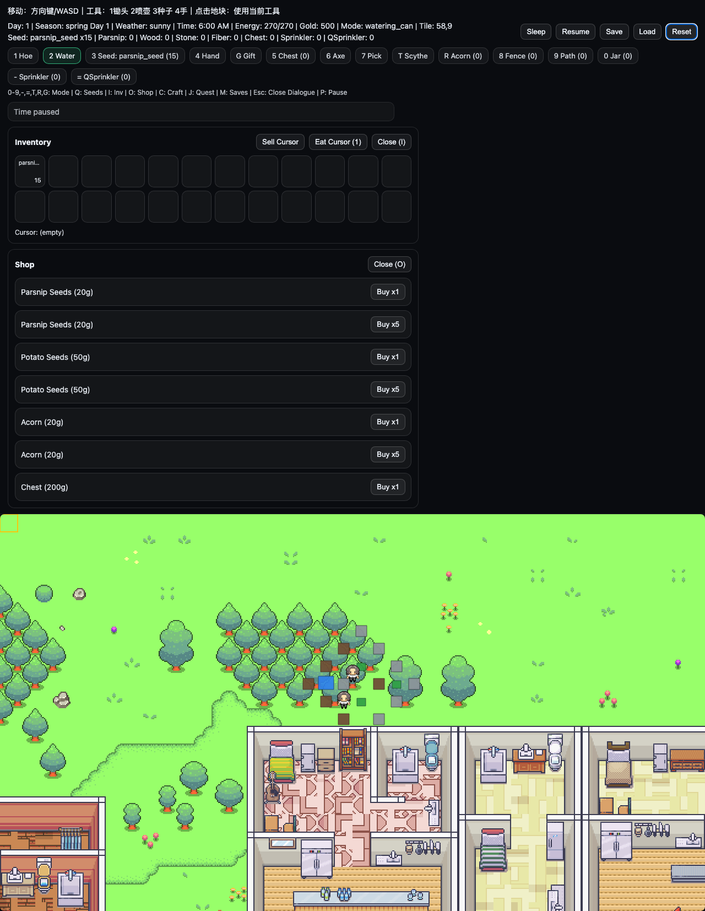

### 2.6 制作（Craft）

打开/关闭：

- 按 `C` 打开/关闭 Craft 面板（打开时会自动暂停时间）

说明：

- 你可以用采集到的 `wood` / `stone` 制作物品
  - 例如：`Fence`（木头）、`Path`（石头）、`Chest`（木头）、`Preserves Jar`（木头+石头）

示意图（Craft 面板）：

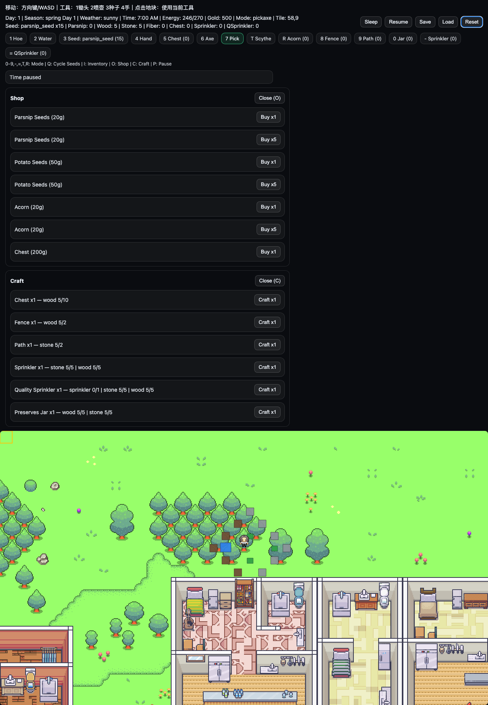

### 2.7 放置物件（Fence / Path / Preserves Jar）

- 先通过 `C` 制作得到 `fence` / `path`（会进入背包）
- 按 `8` / `9` 切换到对应模式
- `Preserves Jar`：按 `0` 切换到罐子模式放置
- 鼠标左键点击玩家相邻 1 格地块放置
- 回收：
  - `6` Axe 点击栅栏可回收
  - `7` Pickaxe 点击地砖可回收
  - `7` Pickaxe 点击 **空闲罐子** 可回收（加工中/有产物则不行）

示意图（放置 Fence/Path）：

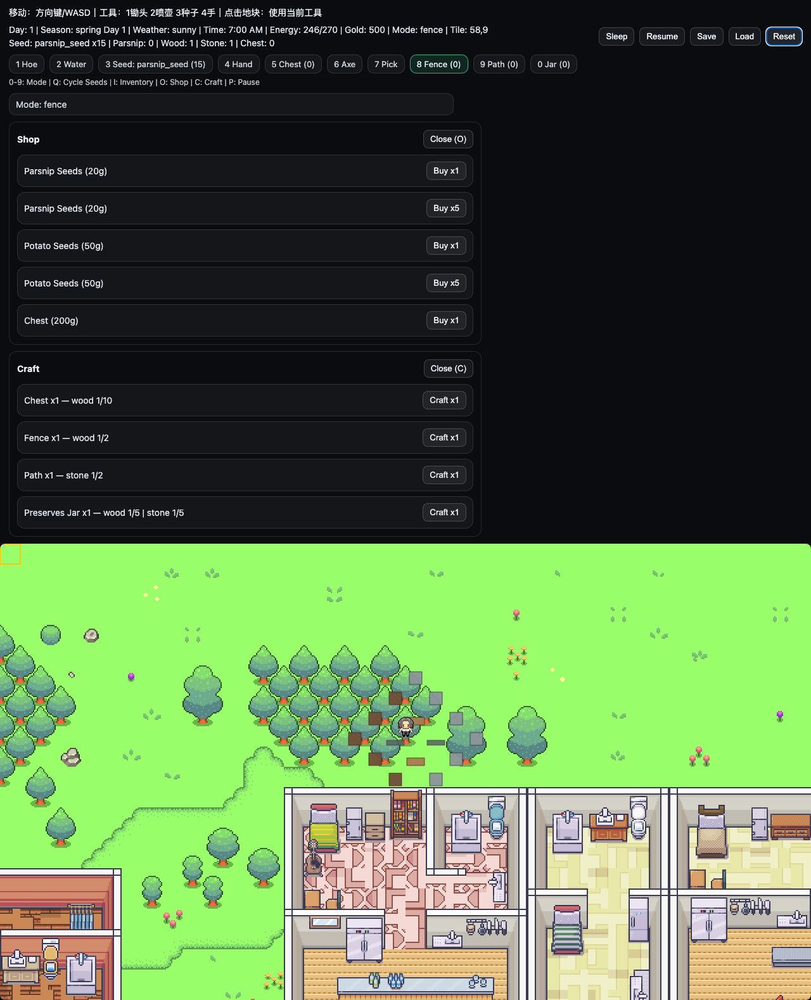

### 2.8 洒水器（Sprinkler：自动浇水）

制作与放置：

- 按 `C` 打开 Craft，制作 `Sprinkler`（需要 `wood`/`stone`）
- 按 `-` 切到 Sprinkler 模式，点击相邻地块放置
- `Quality Sprinkler`：
  - 在 Craft 里制作 `Quality Sprinkler`（需要 `Sprinkler` + 额外材料）
  - 按 `=` 切到 Quality Sprinkler 模式放置

效果：

- 洒水器不会“立刻浇水”，而是在**睡觉后的新一天开始时**自动浇水
  - `Sprinkler`：浇水上下左右 4 格
  - `Quality Sprinkler`：浇水周围 8 格

回收：

- 按 `7` Pickaxe 点击洒水器即可回收

示意图（放置洒水器 + 新一天自动浇水）：

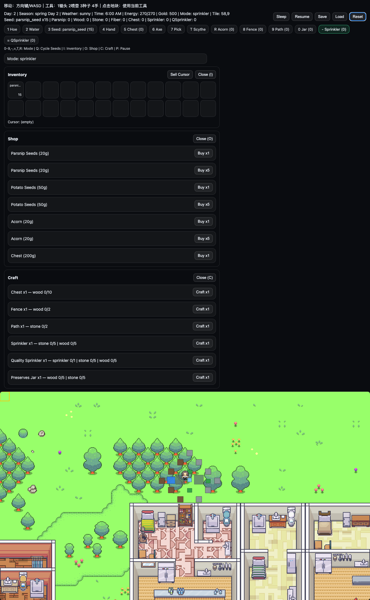

### 2.9 加工（Preserves Jar）

放置：

- 先通过 `C` 制作 `Preserves Jar`（会进入背包）
- 按 `0` 切到罐子模式，点击相邻地块放置

使用：

- 按 `4` 切到 Hand，点击罐子：
  - 如果你背包里有农作物（例如 `parsnip`），会自动放入 1 个开始加工
  - 加工完成后，再点一次会把产物取出（例如 `parsnip_jar`）
- 加工时间：约 `3` 小时游戏内时间（你也可以直接 `Sleep` 快进）

示意图（加工完成可收取）：

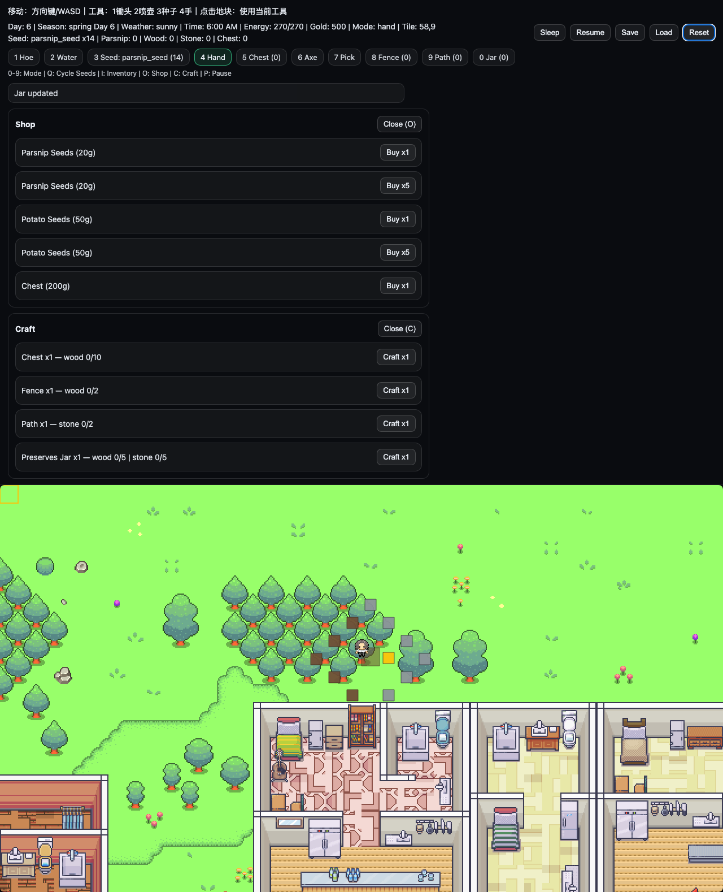

### 2.10 箱子（Chest：存放物品）

放置：

- 先在商店购买 `Chest`
- 按 `5` 切到 Chest 模式
- 鼠标左键点击玩家相邻 1 格地块放置（不能放在已有作物/已有箱子的位置）

打开：

- 按 `4` 切到 Hand
- 点击箱子所在格：会提示 “Chest opened (press I to manage items)”

整理物品：

- 按 `I` 打开 Inventory 后，会在背包下面出现一个 **Chest 网格**
- 用“光标物品（Cursor）”在背包/箱子之间转移：
  - 左键：拿起一整叠 / 放下（合并/交换）
  - 右键：拿起半叠 / 放下 1 个

回收：

- 切到 `6` Axe，对着 **空箱子** 点击一下：会把箱子回收到背包
- 如果箱子里有物品，会提示 “Chest not empty”

示意图（打开箱子 + Inventory 里出现 Chest 网格）：

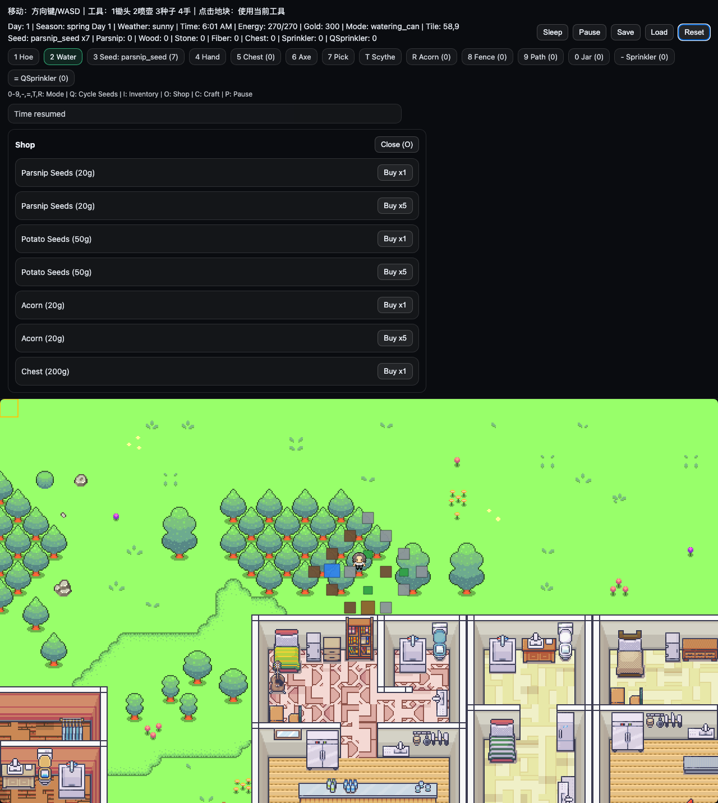

### 2.11 出货箱（Shipping Bin：睡觉自动卖出）

说明：

- 地图上会有一个蓝色的 `Shipping Bin`
- 把你想卖的东西放进 Shipping Bin，睡觉时会自动卖出并增加金币（HUD 的 `Gold`）

打开：

- 按 `4` 切到 Hand，点击 Shipping Bin：提示 “Shipping bin opened (press I to manage items)”
- 按 `I` 打开背包后，会显示一个容器网格（标题为 Shipping Bin），按背包操作方式把物品移进去/移出来

示意图（Shipping Bin 容器管理）：

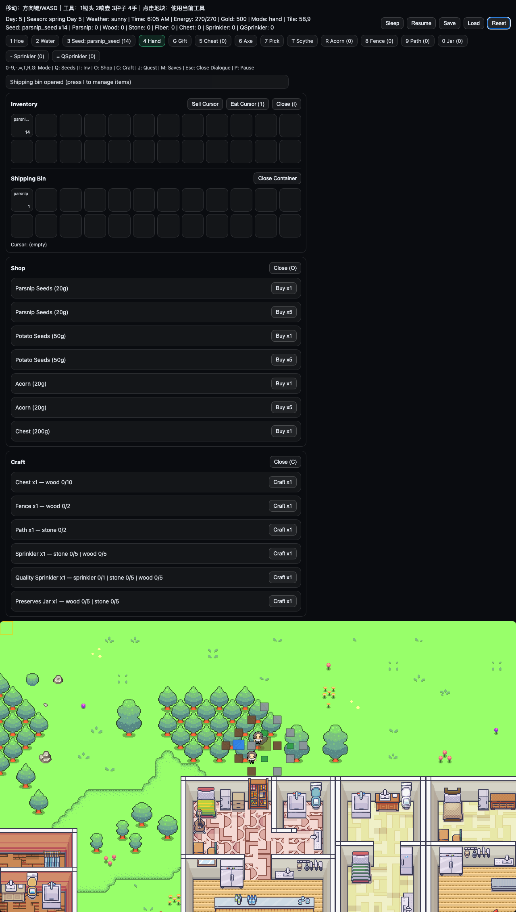

### 2.12 杂草与镰刀（weed / fiber）

说明：

- 地图上会出现一些绿色的 `weed`（杂草，占位方块）
- 用镰刀清理杂草，会掉落 `fiber`（纤维），进入背包

操作：

- 按 `T` 切到 Scythe，对着杂草所在格子点一下：会推进时间；杂草消失并获得 `fiber`

示意图（杂草 + Scythe 模式）：

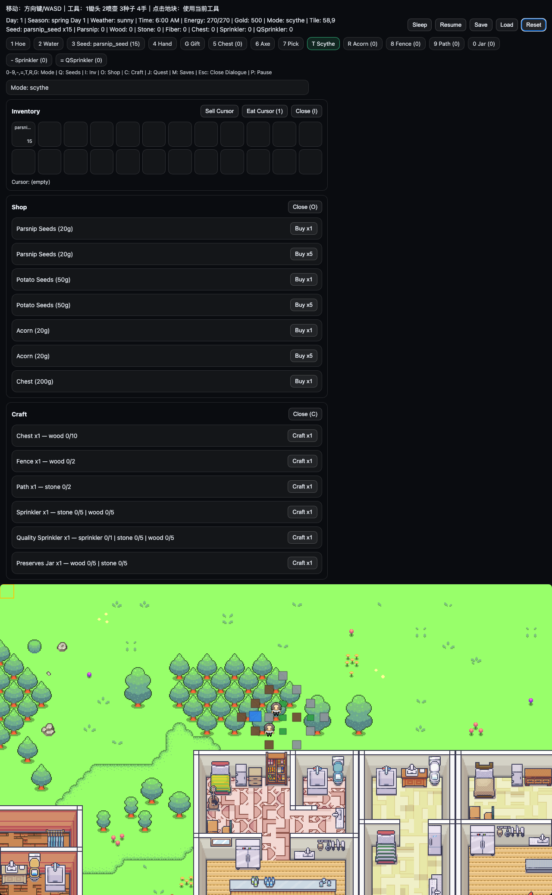

### 2.13 树木（acorn / tree / wood）

说明：

- 在商店购买 `Acorn`（橡果）
- 种在空地上会逐天长大（需要多次睡觉/过天）
- 成熟后可用 `Axe` 砍伐，获得大量 `wood`

操作：

- 购买：按 `O` 打开 Shop，购买 `Acorn`
- 种树：按 `R` 切到 Acorn 模式，点击相邻空地种下
- 砍树：按 `6` 切到 Axe，点击树木多次直到砍倒

示意图（种下并长成树，Axe 可砍伐）：

### 2.14 采集资源（wood / stone）

说明：

- 新存档/Reset 后，会在玩家附近自动生成一些“木头/石头”资源（目前是方块占位）

操作：

- 按 `6` 切到 Axe，对着木头格子点一下：会消耗体力与时间；砍完会掉落 `wood`
- 按 `7` 切到 Pickaxe，对着石头格子点一下：会消耗体力与时间；挖完会掉落 `stone`
- 掉落会直接进入背包（可在 Inventory 里看到）

示意图（木头/石头资源与 Axe 模式）：

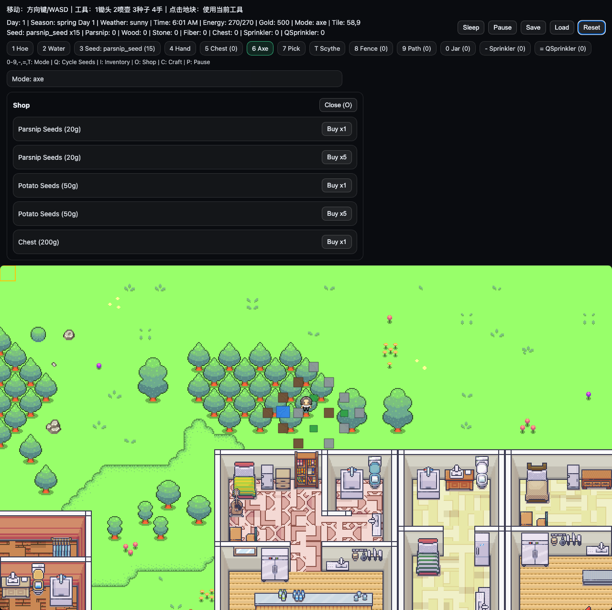

### 2.15 睡觉/过天

- 点击 HUD 的 `Sleep`：推进到下一天
  - 会触发作物生长结算
  - 会把浇水状态重置（需要第二天重新浇水）
  - 会自动保存
  - 如果你把物品放进 Shipping Bin，会在睡觉时自动售出并获得金币

强制过天：

- 到 `2:00 AM` 会自动“睡倒”并进入下一天

---

## 3. 背包（Inventory）

打开/关闭：

- 按 `I` 打开/关闭背包

示意图（Inventory 面板）：

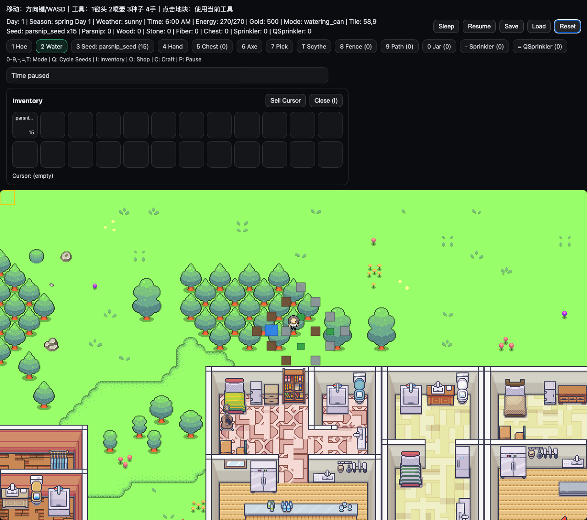

特性：

- 背包是**固定格子**（目前显示 24 格）
- 打开背包会**自动暂停时间**；关闭背包会恢复时间
- 初始存档会给你一些 `parsnip_seed`（防风草种子）

拖拽/分堆（当前实现）：

- 背包里**左键**格子：
  - 手上没拿东西：拿起整叠
  - 手上拿着东西：放下/合并/交换（视格子内容而定）
- 背包里**右键**格子：
  - 手上没拿东西：拿起半叠
  - 手上拿着东西：每次放下 1 个（如果能放）

出售：

- 背包面板右上角有 `Sell Cursor`：会把你手上拿着的一整叠卖掉并获得金币（Gold）

---

## 4. 常见问题

### 4.1 我点地块没反应

通常是以下原因之一：

- 你点的地块离玩家太远（选格框会变黄）→ 先走到旁边再点
- 你点的是阻挡地块（选格框会变红）
- 体力不足（HUD `Energy` 变成 0）→ 先 `Sleep`
- 没有种子（当前选中的种子数量为 0）→ 按 `Q` 切换到背包里有的种子，或按 `O` 打开 Shop 购买

页面底部会出现短暂提示（toast）说明失败原因。

### 4.2 怎么保存/读取/重开？

在 HUD 上：

- `Save`：手动保存
- `Load`：从本地存档读取
- `Reset`：重置为新存档（会覆盖当前存档）

---

## 5. 建议的上手流程（1 分钟体验）

1) 按 `Reset`（确保有种子）
2) 走到一块空地旁边
3) 按 `1`，点相邻格子（耕地）
4) 按 `2`，点同一格（浇水）
5) 按 `3`，点同一格（播种；如果想换种子按 `Q`）
6) 每天重复一次：`2` 浇水 → `Sleep`
7) 作物成熟后按 `4` 点作物格子收获
8) 按 `I` 看背包里 `parsnip` 数量变化
